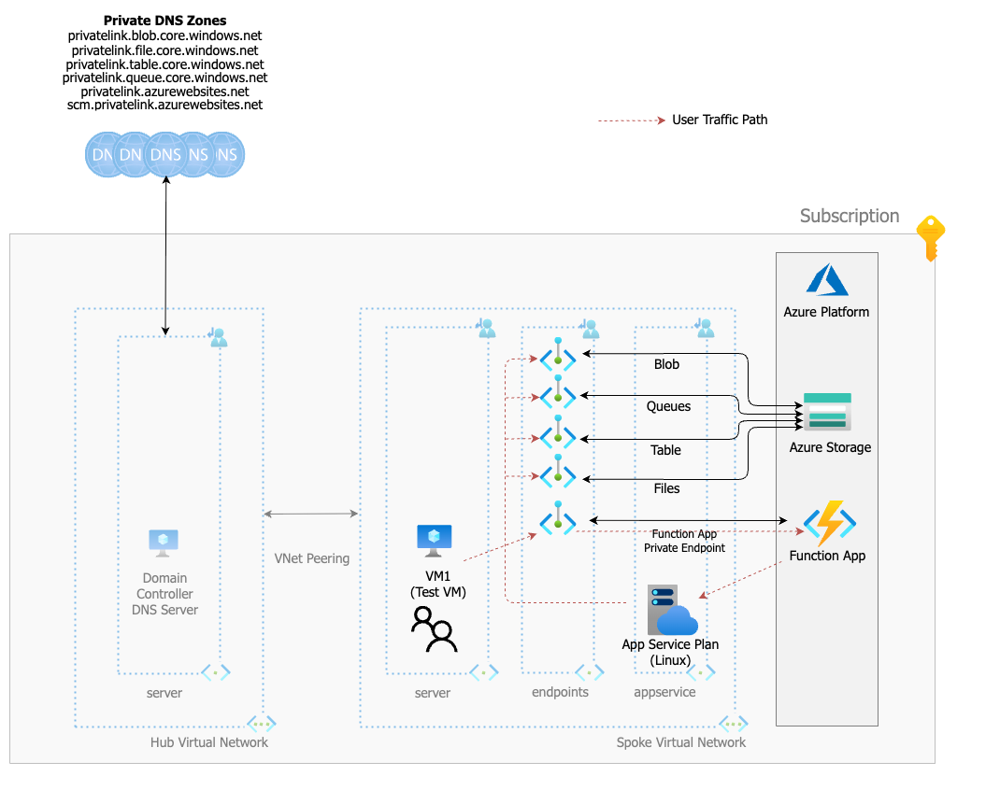
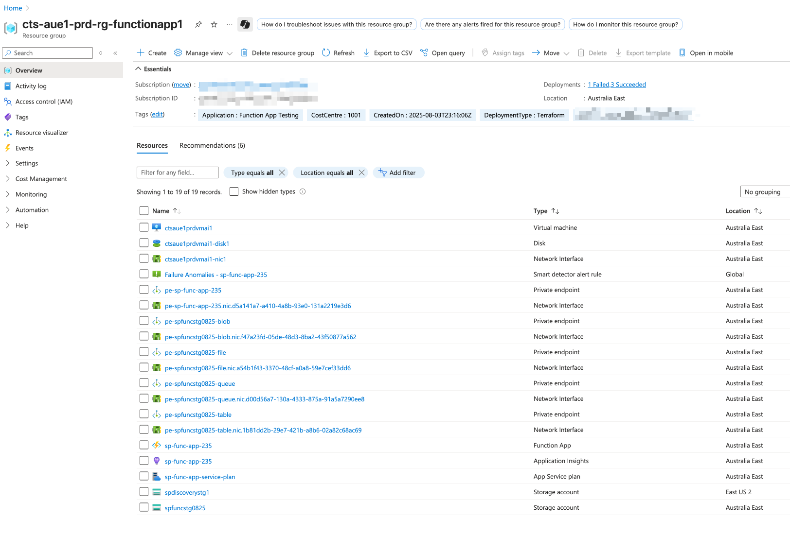
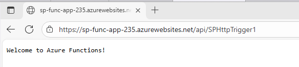

# Azure Function App with Network Isolation Lab

This lab provisions a network-isolated Azure Function App with Linux runtime in a hub-spoke network topology. The Function App is completely isolated from public internet access and integrates with existing virtual network infrastructure.

## Overview

This Terraform configuration creates a secure, network-isolated Function App environment that demonstrates enterprise-grade security patterns for serverless applications. The setup includes private endpoints for all storage services and leverages existing hub-spoke network infrastructure.

## Architecture



The architecture implements a secure, network-isolated Function App with the following components:

- **Hub-Spoke Network Topology**: Integrates with existing hub-spoke virtual network design
- **Private Endpoint Subnet**: Dedicated subnet for private endpoint connections
- **App Service Integration Subnet**: Dedicated subnet for VNet integration
- **Private DNS Zones**: Shared DNS infrastructure for name resolution
- **Network Isolation**: Complete isolation from public internet access

## Key Features

### ✅ VNet Integrated App Service Plan
- **Linux-based App Service Plan** running on Premium P0v3 SKU
- **VNet Integration** with dedicated app service subnet
- **Route All Traffic** through virtual network enabled
- **Always On** enabled for consistent performance

### ✅ Network-Isolated Function App
- **Private Endpoint** for inbound access (`privatelink.azurewebsites.net`)
- **Public network access disabled** for complete isolation
- **.NET 8 isolated runtime** for modern application development
- **DNS inheritance from VNet** for custom DNS resolution

### ✅ Secure Storage Account
- **Four private endpoints** for comprehensive storage isolation:
  - Blob storage (`privatelink.blob.core.windows.net`)
  - File storage (`privatelink.file.core.windows.net`)
  - Table storage (`privatelink.table.core.windows.net`)
  - Queue storage (`privatelink.queue.core.windows.net`)
- **Public network access disabled** with network rules enforced
- **Standard LRS replication** for cost-effective storage

### ✅ Test Machine Integration
- **VM in the spoke network** for testing private connectivity
- **Access to Function App** through private endpoint
- **Storage access** through private endpoints only

### ✅ Shared DNS Infrastructure
- **Private DNS zones** managed in separate project
- **Automatic DNS record creation** via private DNS zone groups
- **Hub-spoke DNS integration** for centralized name resolution

### ✅ Hub-Spoke Topology Integration
- **Leverages existing VNet infrastructure** from hub-spoke lab
- **Reuses private DNS zones** for cost optimization
- **Consistent network security patterns** across environments

## Prerequisites

- Existing hub-spoke network topology
- Private DNS zones provisioned in shared infrastructure:
  - `privatelink.azurewebsites.net`
  - `privatelink.blob.core.windows.net`
  - `privatelink.file.core.windows.net`
  - `privatelink.table.core.windows.net`
  - `privatelink.queue.core.windows.net`
- Dedicated subnets for:
  - Private endpoints
  - App Service integration

## Configuration Variables

Update the following variables in your `terraform.tfvars` file:

```hcl
# DNS Configuration
dns_resource_group_name = "your-dns-resource-group"

# VNet Configuration
vnet_name = "cts-aue1-prd-vnet-spoke1"
vnet_rg_name = "cts-aue1-prd-rg-spoke1"
vnet_private_endpoint_subnet_name = "endpoints"
vnet_appservice_subnet_name = "appservice"

# Location
location = "Australia East"
```

## Deployment

1. **Initialize Terraform**:
   ```bash
   terraform init
   ```

2. **Plan the deployment**:
   ```bash
   terraform plan
   ```

3. **Apply the configuration**:
   ```bash
   terraform apply
   ```



## Application Deployment

No application is deployed by default. You can deploy the sample .NET application using the provided ZIP file:

```bash
az functionapp deployment source config-zip --resource-group cts-aue1-prd-rg-functionapp1 --name sp-func-app-235 --src sample_app/function-app.zip
```

## Testing

Once deployed, the Function App can be accessed via private endpoint from within the VNet:

**Example URL**: `https://sp-func-app-235.azurewebsites.net/api/SPHttpTrigger1`



> **Note**: This URL will only be accessible from within the virtual network or through connected networks due to private endpoint configuration.

## Security Features

- **Zero public internet access** to Function App and storage
- **Private endpoint encryption** for all data in transit
- **VNet traffic isolation** with route all enabled
- **Managed identity integration** for secure service-to-service communication
- **Hub-spoke network segmentation** for defense in depth

## Cost Optimization

- **Shared DNS zones** reduce infrastructure duplication
- **Premium P0v3 plan** provides good price-performance ratio
- **Standard LRS storage** for cost-effective persistence
- **Leverages existing VNet infrastructure** minimizing additional networking costs

## Troubleshooting

### Common Issues

1. **Function App runtime errors**: Ensure `AzureWebJobsStorage` connection string is properly configured
2. **DNS resolution issues**: Verify private DNS zones are linked to the VNet
3. **Storage connectivity**: Check that all required private endpoints are healthy
4. **VNet integration**: Ensure app service subnet delegation is configured correctly

### Verification Commands

```bash
# Check Function App status
az functionapp show --name sp-func-app-235 --resource-group cts-aue1-prd-rg-functionapp1

# Verify private endpoints
az network private-endpoint list --resource-group cts-aue1-prd-rg-functionapp1

# Test DNS resolution (from VM in VNet)
nslookup sp-func-app-235.azurewebsites.net
nslookup spfuncstg0825.blob.core.windows.net
```

## Integration with Hub-Spoke Lab

This Function App lab is designed to integrate seamlessly with the hub-spoke network topology lab. It demonstrates:

- **Consistent security patterns** across workloads
- **Shared infrastructure reuse** for cost efficiency
- **Network segmentation** following enterprise best practices
- **Centralized DNS management** for simplified operations

## Next Steps

- Deploy custom .NET applications to the Function App
- Implement Azure Key Vault integration for secrets management
- Add Application Insights for monitoring and observability
- Configure custom domains with SSL certificates
- Implement CI/CD pipelines for automated deployments
